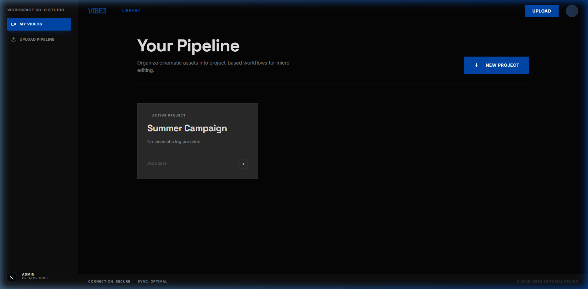
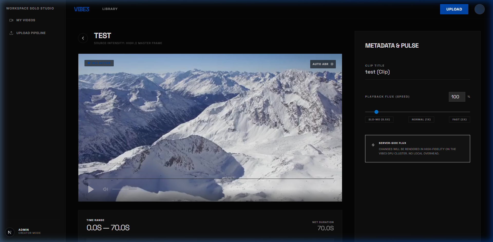
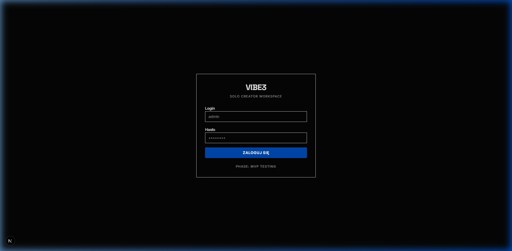
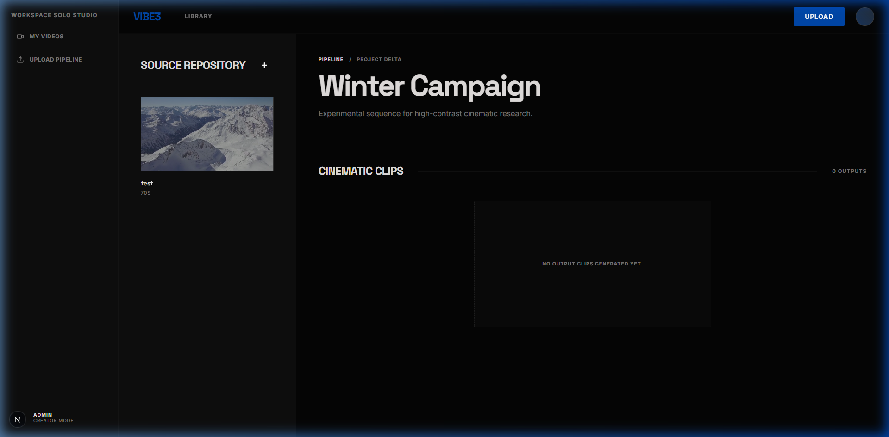

# Vibe3: Video Editing Proof of Concept (PoC) 🎥⚙️🚀

> [!NOTE]
> This project is a **Proof of Concept**. It demonstrates a functional video clipping pipeline but is not intended for production use in its current state.

Vibe3 is a video editing tool built to explore fast clipping workflows. Create projects, upload source videos, and generate clips with custom speed controls (10% to 1000%).

## ✨ Features
- **Project Organization**: Hierarchical storage for source videos and clips.
- **Modernist UI**: High-contrast aesthetic built with **Tailwind CSS 4** and **Space Grotesk**.
- **Clipping**: Accurate trimming with customizable playback speed (fast/slow motion).

## 📸 Visual Showcase

### 1. Dashboard & Projects

*Dashboard with project-level organization.*

### 2. MicroEditor Interface

*The editing interface: HLS streaming, playback speed controls, and metadata.*

### 3. Workflow
 | 
--- | ---
*Login* | *Project View*

## 🛠️ Tech Stack
- **Frontend**: Next.js 16 (App Router), Tailwind CSS 4, Framer Motion.
- **Backend/Worker**: Node.js, BullMQ, Redis, FFmpeg.
- **Database**: PostgreSQL (Drizzle ORM).
- **Storage**: S3-Compatible (Cloudflare R2 / MinIO).
- **Infra**: Docker Compose.

## 🚀 Getting Started

### 1. Prerequisites
- [Node.js](https://nodejs.org/) (v20+)
- [pnpm](https://pnpm.io/)
- [Docker Desktop](https://www.docker.com/products/docker-desktop/)
- [FFmpeg](https://ffmpeg.org/)

### 2. Installation
```bash
git clone https://github.com/your-username/Vibe3-editing-platform.git
cd Vibe3-editing-platform
pnpm install
```

### 3. Environment Setup
Rename the `.env.example` templates in the root, `apps/web`, and `apps/worker` to `.env` / `.env.local` and fill in your credentials.

### 4. Infrastructure
```bash
docker compose up -d
```

### 5. Running
```bash
# Start both Web and Worker in dev mode
pnpm dev
```

## 🏗️ Project Structure
- `/apps/web`: Next.js 16 frontend and API.
- `/apps/worker`: Video processing (FFmpeg + BullMQ).
- `/packages/db`: Database schema and client.
- `/packages/queue`: Shared job queue configuration.
- `/packages/ui`: Shared UI components.

---
Built with ⚡ by an Advanced Agentic Coding System.
